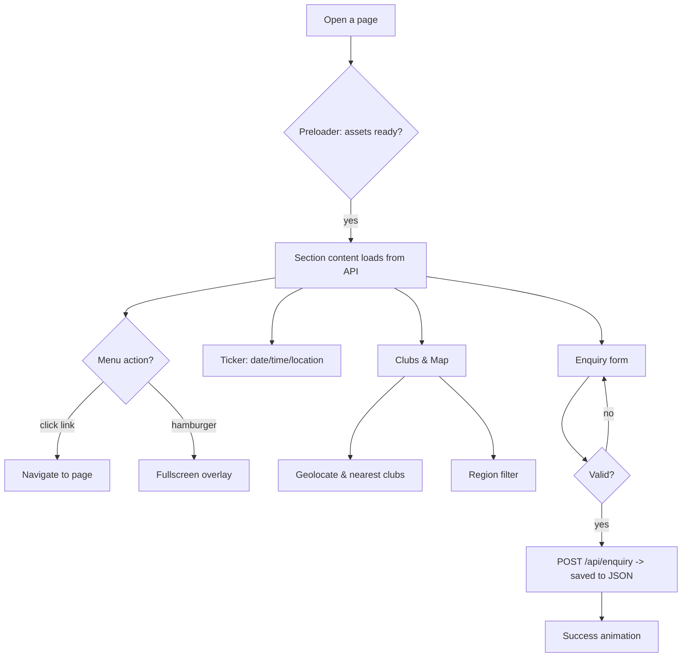
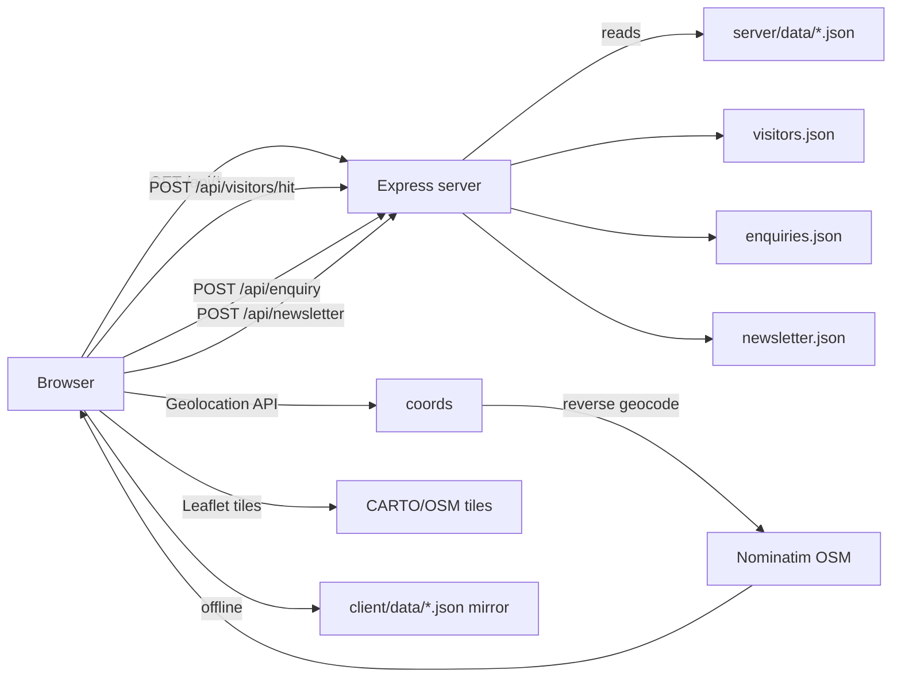

# Alpine Ascents · Technical Documentation Report

## 1. Problem Definition

Alpine Ascents is a (fictional) mountaineering and expedition brand that needs a single, premium, visually striking, information-rich website to present its offering: expedition types, mountaineering history, techniques, sheltering, hazards and safety guidance, world records, an interactive map of mountaineering clubs/organisations, success stories, a gallery with embedded educational videos, latest news, general guidelines and an enquiry form.

Technical requirements:

- Multi-page site: 13 individual HTML pages with a shared navbar/footer/ticker, fully responsive (360 → 1920), no horizontal scroll.
- Client: HTML5, CSS, JavaScript, **Bootstrap 5**, **jQuery**. Animations via CSS + JS (Intersection reveal, counters, parallax, magnetic buttons, marquee).
- Leaflet + OpenStreetMap tiles on a dark theme, browser Geolocation API with graceful permission-denied handling and an "Find clubs near me" control.
- Node.js + Express backend with JSON-file data store, REST endpoints, GET visitors + POST visitor hit counter, contact/enquiry POST with validation.
- Continuous bottom ticker with current date, live 1-second clock, user location (HTML5 Geolocation + OpenStreetMap Nominatim reverse geocoding with a polite fallback).
- Visitor counter top-right beside the logo, persisted by the backend, counted once per browser session.
- Reduced-motion support, accessibility (semantic HTML, aria labels, keyboard trap for overlays, focus states), SEO tags, Open Graph, local optimized assets.
- Clean folder structure, reusable CSS/JS, no console errors.

## 2. Design Specification

| Area | Specification |
| --- | --- |
| Theme | Dark, cinematic alpine. BG `#0B0F14` (midnight navy), text `#F4F7FA` (glacier white), accents `#C9A961` (champagne gold, CTAs/lines/highlights), `#8FB8D8` (icy blue), slate greys. |
| Type | Display: 'Cormorant Garamond'. Body: 'Inter'. Small-caps labels with wide tracking, large airy headings. |
| Effects | Glass navbar (fixed, hide-on-scroll-down/show-on-scroll-up, shadow on scroll), soft image gradients, film grain (SVG turbulence), thin gold divider lines, custom scrollbar, custom cursor ring (desktop), smooth hover lift, fade-up reveals, parallax on section backdrops, count-up numbers, magnetic buttons, card tilt, flip cards on types. |
| Nav reactivity | Glass on scroll > 30px, hides while scrolling down after 260px, shows on scroll up, active-page state with gold underline, mobile full-screen staggered overlay with focus trap. |
| Pages | index (hero + about/stats + expedition preview + why us) · expeditions (catalogue with itineraries) · history (timeline) · types (flip cards) · techniques (tabs) · sheltering · hazards · records · clubs (map) · stories (carousel) · gallery (masonry + video) · latest (news modal) · guidelines (checklists + printable gear list) · contact (form + guides + FAQ). |
| Ticker | Fixed bottom glass bar, CSS marquee (70s, pauses on hover), live date/time, location with polite denial fallback, reduced-motion variant. |
| Accessibility | Semantic sections/headings, alt text on all imagery, aria labels/roles on tabs/chips/modals/map, visible focus rings, AA contrast (light text on #0B0F14), i18n-friendly English copy. |
| Performance | Only transform/opacity animated, lazy/deferred images, static grain (no JS loop), shared rAF loop for parallax+counters, images optimised & LQIP (blur-up) variants local to the repo. |

## 3. Flowchart (visitor journey)



## 4. Data Flow Diagram



## 5. Test Data Used

All content lives in `server/data/*.json` (and is mirrored into `client/data/*`):

- `expeditions.json` — 10 guided expeditions (Mont Blanc, Matterhorn, Island Peak, Ama Dablam, Denali, Aconcagua, Haute Route, intro course, Lyngen, Kilimanjaro) with height, country, region, duration, season, difficulty 1-5, grade, price, group size, guide ratio, highlights, inclusions, required skills and a 4-6 day itinerary each.
- `clubs.json` — 22 organisations: Nepal Mountaineering Association (27.71 N, 85.32 E), Alpine Club of Pakistan (33.68 N, 73.04 E), Swiss Alpine Club (46.94 N, 7.44 E), FFCAM Chamonix, Club Alpino Italiano, American Alpine Club, Alpine Club of Canada, Club Andino Bariloche, NZAC, IMF, JAC, Mountain Club of Kenya, The Alpine Club UK, ÖAV, Mazamas, FEDME, DAV, NORTIND, SMC, Unión de Andinistas de Chile, Icelandic Alpine Club, PTTK. Each has founded year, members, description, url, email, image key, and 2 upcoming expeditions.
- `history.json` — 17 milestones (1786 Mont Blanc → 2019 Project Possible) with people, place, text, image key.
- `types.json` — 10 disciplines with difficulty 1-5, season, grades, skills, iconic objectives.
- `techniques.json` — 12 skills, each with 4 steps and a guide tip.
- `shelter.json` — 7 options with warmth/weight/build-time hints and 4 field tips each.
- `hazards.json` — 8 hazards with risk level, likelihood/severity 1-5, signs and 4 safety tips each.
- `records.json` — 5 ranked groups (highest peaks, first ascents, fastest/most, youngest/oldest, women's records) with numeric values for animated count-up display.
- `stories.json` — 12 client stories with quotes, expedition names and years.
- `gallery.json` — 36 items in 5 image categories, 6 tutorial/inspirational videos (youtube-nocookie embeds with consent-aware autoplay).
- `news.json` — 10 articles (climate, gear, routes, safety-tech, records, Olympic skimo, Himalayan regulations, permafrost research, crampon standards, hut modernisation).
- `guidelines.json` — 6 checklists (fitness, gear, permits, leave-no-trace, insurance, emergency) + `gearChecklist` grouped into 5 categories for the printable view.
- `stats.json` — 4 headline counters.
- `visitors.json` — `{ "count": 12480, "lastVisit": ... }`.

## 6. Assumptions and Limits

- Node 18+ and npm 9+ available; internet access is required the first time to download Unsplash imagery (`client/images`) and the local npm/vendor packages (Bootstrap, jQuery, Leaflet, Bootstrap Icons).
- OpenStreetMap tiles, Nominatim lookups and YouTube-nocookie embeds require connectivity at runtime.
- Visitor start count is seeded in `visitors.json`; each POST `/api/visitors/hit` increments it once per browser session (tracked via `sessionStorage`). Restarting the server preserves counts.
- Contact form saves enquiries to `server/data/enquiries.json` (with honeypot + validation). A bot fill gets a fake success and is not persisted.
- The printable gear checklist uses a new window with a simple serif style; users save it as PDF via the browser's own Print dialog.
- No API authentication by design (public demo content); write endpoints are rate-limited in-memory (enquiry/newsletter 8/min/IP, visitors 30/min/IP).
- Page HTML is generated by `scripts/build-pages.mjs` from `client/pages/*.html` partials plus a shared shell, so the navbar, meta tags, footer and ticker stay consistent across all 13 pages. Each page loads only the section modules its markup contains.

## 7. Installation Instructions

```bash
# 1. clone / copy the project
cd "D:\e project"

# 2. install everything (root, server, client)
npm install

# 3. start both front end (:5173) and API (:3001)
npm run dev

# 4. open http://localhost:5173

# optional: serve the front end from the API on :3001
npm start
```

Re-run `npm run images` to refresh imagery, and `npm --prefix client run setup` to refresh the bundled mirror data after editing `server/data/*.json`.
